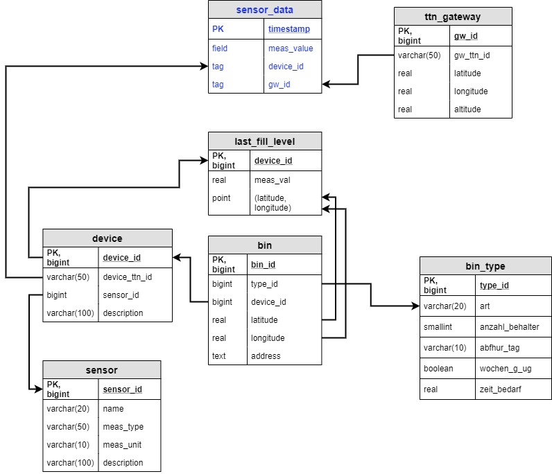

### Database Setup Guide
#### 1. Database Relational Structure
Similar to last year's project, this project uses PostgreSQL as the database server on the backend to store relational data tables.

The original database structure from EMRP18 is modified such that the `sensor_data` table is replaced by a new table called `last_fill_level` which stores only the last sensor value of any active device received from the MQTT broker, as well as its location. The reason being PostgreSQL is not optimized for streaming data, which is the sensor data in this case, but is more suitable for relational data tables. Additionally, a new table called `bin_type` is added to describe the common properties of the bins. In this case, we only have 1 bin type as can be seen in the [CSV data given by ENNI](../code/database/paper_bins.csv).

Optionally, the streaming data can be separately stored in an `InfluxDB` database, which is time-series database type. However, storing all meta-data in the `InfluxDB` table would give one series for each combination of meta-data, resulting in too many series in the end and thus slowing down the querying process. Thus, only the most important meta-data of the TTN MQTT messages including `gateway ID` and `device ID` will be used as `tags` for each insertion into InfluxDB. 


Below is a digram of the new database structure.



*Note:
- "sensor_data" table is stored in InfluxDB
- remaining tables are stored in ProgreSQL


#### 2. Initialization of database
- Insert the first bin type into `bin_type` table:
```
type_id: 1
art: Papierkorb
anzahl_behalter: 1
zeit_bedarf: 0.5 
```

- Insert all bins and its location from the [paper_bins.csv](../code/database/paper_bins.csv) file into the `bin` table using [this Python script](../code/database/insert_bin_data.py).

- Insert the first sensor type into `sensor` table:
```
sensor_id: 1
name: vl520lx
meas_type: distance
meas_unit: cm
description: VL53L0X Time-of-Flight Distance Sensor Breakout Board 
```

- Insert the first device into `device` table:
```
device_id: 1
device_ttn_id: heltech_lora            #id of gateway as registered in The Things Network
sensor_id: 1
description: Heltech WiFi_LoRa_32 (V1)
```

 Insert the first gateway into `gateway` table:
```
gw_id: 1
gw_ttn_id: eui-b827ebfffe21faed        #id of gateway as registered in The Things Network
latitude: 51.49
longitude: 6.54
altitude: 7
```

#### 3. Fetch sensor data from TTN MQTT Broker and save to database
As shown in [section 6 of the LoRa node setup guide](node_setup.md#6), the payload from TTN is a dictionary with several parameters, among which we save the value of `digital_out_1` from the `Payload fields` as the measurement value in `last_fill_level` PostgreSQL table. The `digital_out_1` value can optionally be saved as sensor data and the `gtw_id` and `device_id` as tags for the InfluxDB table. The Python script to perform this task is found [here](../code/database/ttn_mqtt_to_db.py). 