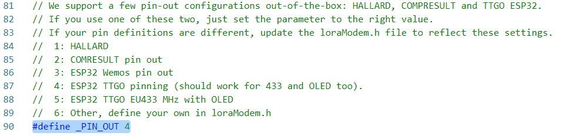
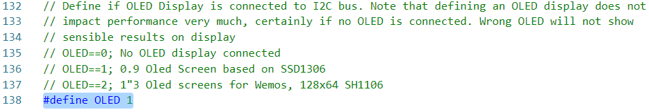
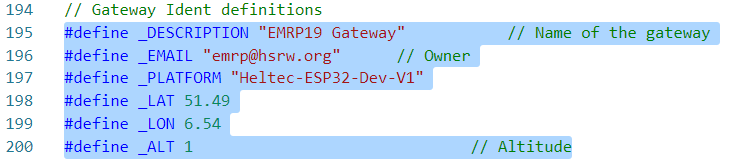

### Set up Single-channel LORAWAN gateway
Code from [this repo](https://github.com/things4u/ESP-1ch-Gateway-v5.0), instructions from http://things4u.github.io/

The following modifications have to be made in the `ESP-sc-gway-h` header file for the Heltech ESP32 WiFi LoRa (V1) Dev boards:
- (Line 90) set `_PIN_OUT` to 4

- (Line 138) set `OLED` to 0 

- (Line 195-200) change the gateway info accordingly

- (Line 261-265) fill in WiFi SSID for Gateway Manager 

