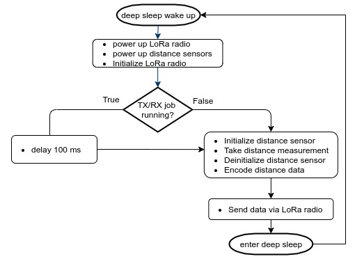

# Node Firmware

Research for the node firmware is partially based on previous work by EMRP18 project "Smart Cities: Internet of Waste Bins with LoRa" as described in [5. Writing the Embedded Software](https://github.com/emrp/emrp2018_Moers_Trashbins/blob/master/documentation/from_sensor_to_ttn.md#5-writing-the-embedded-software).

## Programm logic flow

The figure below shows the program logic flow as it is implemented in the node firmaware `garbage_bin__heltech_vl53l0x_ttn.ino`, from first power on/deep sleep wake up until enter deep sleep.
The main function of the programm is to take a distance measurement from the `VL53L0X` sensor, encode it and send the data over the LoRa radio to the next TTN gateway. After every cycle the node goes into deep sleep mode to preserve power. After a predefined amount of time (here 30 seconds) it wakes up again and repeats the cycle.

